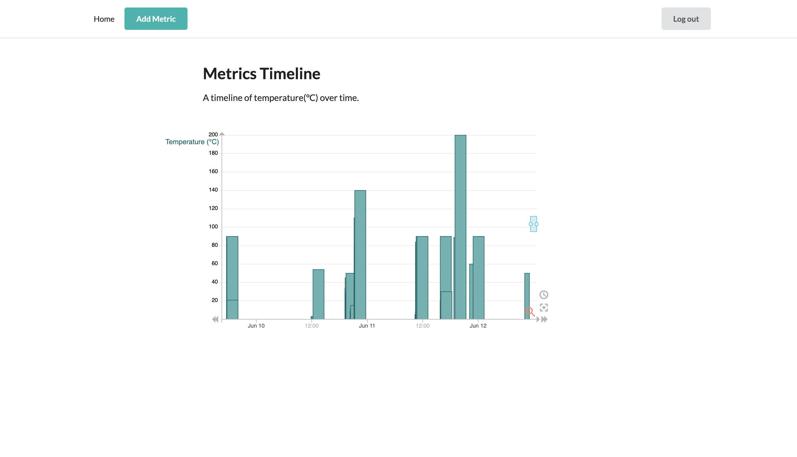

# METRICS

Metrics is an application that allows you to post and visualize metrics. It takes in metric values as integers with timestamps attached to each metric.

The app consists of a backend and frontend. To run the application, follow the instructions below:-
 - [Frontend](/frontend/README.md)
 - [Backend](/backend/README.md)

## Assumptions
- The metric timestamp is auto captured at the time the user posts a metric.
- All metrics are for Temperature in degrees celsius.
- Metric values are integers.
